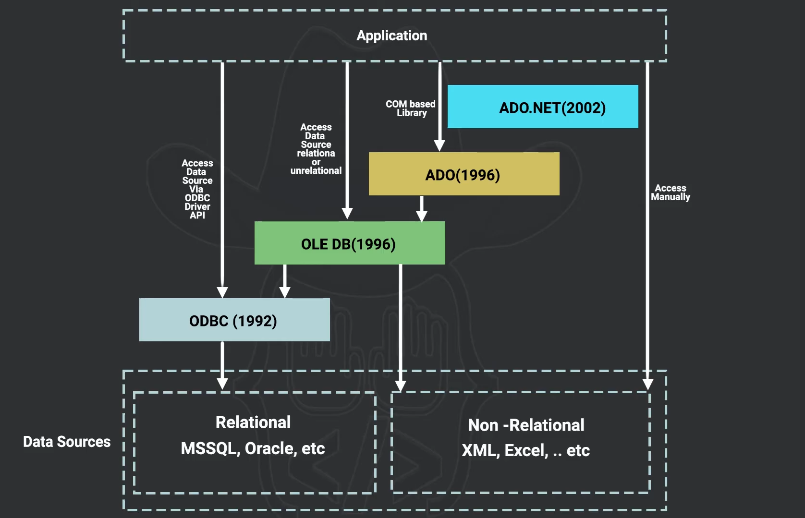

# ADO.NET

An overview of ADO.NET and its role in data access within the .NET ecosystem.

---

## Overview

ADO.NET is a data access technology in the .NET platform that enables applications to communicate with relational databases and other data sources.

It provides a set of classes that allow developers to connect to a database, execute commands, retrieve results, and manage data efficiently.

ADO.NET is designed for performance, scalability, and flexibility when working with structured data.

---

## Purpose

The main purpose of ADO.NET is to provide a reliable and efficient way for .NET applications to access and manipulate data stored in external data sources such as relational databases.

It serves as the foundation for many higher-level data access technologies in the .NET ecosystem.

---

## Architecture

ADO.NET is built around two main data access models:

### Connected Model

The application maintains an active connection with the database while performing operations.

This model is designed for high-performance scenarios where data is accessed directly from the database.

### Disconnected Model

The application retrieves data and works with it locally in memory, allowing the database connection to close.

This model improves scalability by reducing the time the database connection remains open.

---

## Core Components

### Data Providers

Data providers allow communication with specific database systems.  
They contain classes responsible for managing connections and executing commands.

### Connection

Represents the communication channel between the application and the database.

### Command

Represents a database instruction such as a query or stored procedure.

### DataReader

Provides a fast, forward-only stream of data from a data source.

### DataSet

An in-memory representation of data that can contain multiple tables and relationships.

### DataAdapter

Acts as a bridge between the database and the in-memory data structures.

---

## Key Features

- Direct database connectivity
- High-performance data access
- Support for both connected and disconnected models
- Provider-based architecture
- Integration with .NET applications

---

## Advantages

- Fine control over database operations
- High performance for direct data access
- Flexible architecture
- Supports multiple database providers
- Scalable for enterprise applications

---

## Limitations

- Requires more manual coding compared to modern ORMs
- Less abstraction than higher-level frameworks
- Increased complexity in large applications

---

## Relationship with Other Technologies

ADO.NET forms the underlying data access layer for several .NET technologies, including:

- Entity Framework
- Dapper
- ASP.NET data access layers

These technologies often build on top of ADO.NET to provide higher-level abstractions.

---

## Summary

ADO.NET is a fundamental data access technology in the .NET platform that provides developers with the tools necessary to interact directly with databases.

It offers both connected and disconnected data models, allowing developers to choose the approach that best fits their application's performance and scalability requirements.

---

## Author

Mohamed Magdy
