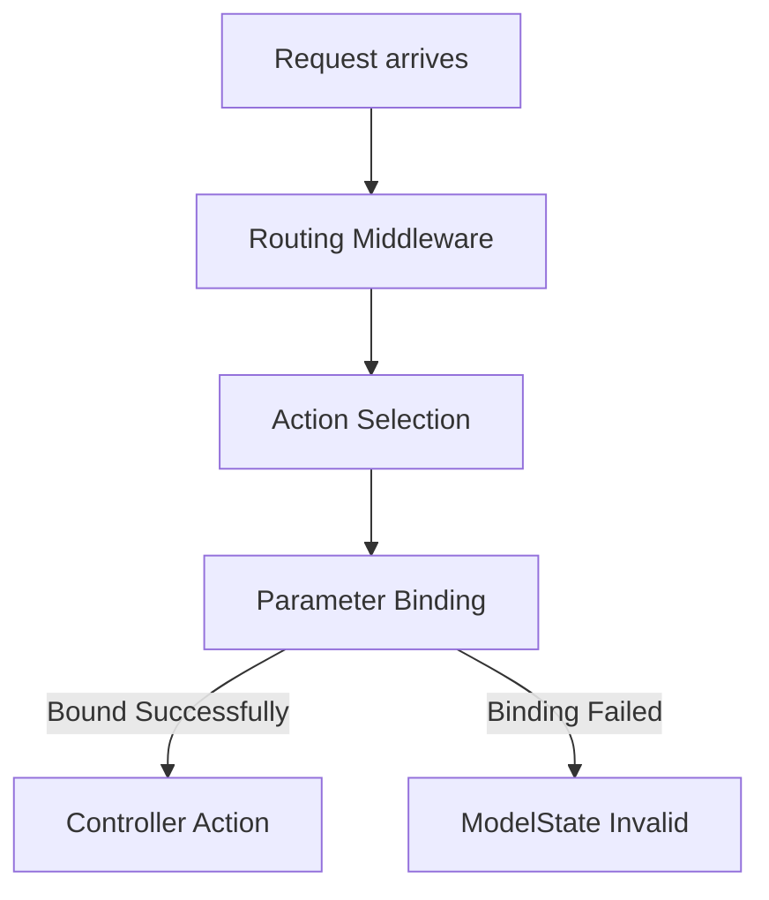

# Model Binding in ASP.NET Core Web API

This README explains **Model Binding** in ASP.NET Core Web APIs, detailing how the framework binds HTTP request data to action parameters and models.

---

## 1️⃣ Overview

**Model Binding** maps data from an HTTP request (query string, route data, headers, form fields, or body) to action method parameters or model properties.

It allows you to work with strongly typed objects in your controller actions instead of manually parsing the request.

---

## 2️⃣ Sources for Model Binding

ASP.NET Core can bind data from multiple sources:

| Source                          | Example                     | How to Use       |
| ------------------------------- | --------------------------- | ---------------- |
| Query string                    | `/api/users?id=1&name=John` | `[FromQuery]`    |
| Route data                      | `/api/users/1`              | `[FromRoute]`    |
| Request body (JSON)             | `{ "id":1, "name":"John" }` | `[FromBody]`     |
| Form data                       | `<form>` POST               | `[FromForm]`     |
| Headers                         | `X-Api-Key: abc`            | `[FromHeader]`   |
| Services / Dependency Injection | Logger, DbContext           | `[FromServices]` |

> By default, ASP.NET Core automatically infers the source based on parameter type and HTTP method.

---

## 3️⃣ Example: Query and Route Binding

```csharp
[ApiController]
[Route("api/[controller]")]
public class UsersController : ControllerBase
{
    // GET api/users?id=1
    [HttpGet("query")]
    public IActionResult GetUserByQuery([FromQuery] int id, [FromQuery] string name)
    {
        return Ok(new { Id = id, Name = name });
    }

    // GET api/users/1
    [HttpGet("{id}")]
    public IActionResult GetUserByRoute([FromRoute] int id)
    {
        return Ok(new { Id = id });
    }
}
```

---

## 4️⃣ Example: Binding from Body

```csharp
public class UserDto
{
    public int Id { get; set; }
    public string Name { get; set; }
}

[HttpPost]
public IActionResult CreateUser([FromBody] UserDto user)
{
    return Ok(user);
}
```

> Note: Only **one parameter per action can be bound from the body**.

---

## 5️⃣ Binding From Form Data

```csharp
[HttpPost("upload")]
public IActionResult UploadFile([FromForm] IFormFile file, [FromForm] string description)
{
    return Ok(new { FileName = file.FileName, Description = description });
}
```

---

## 6️⃣ Binding From Headers

```csharp
[HttpGet("apikey")]
public IActionResult GetWithApiKey([FromHeader(Name="X-Api-Key")] string apiKey)
{
    return Ok(new { ApiKey = apiKey });
}
```

---

## 7️⃣ Complex Object Binding

ASP.NET Core can automatically bind **nested objects**:

```csharp
public class Address
{
    public string City { get; set; }
    public string Street { get; set; }
}

public class UserDto
{
    public string Name { get; set; }
    public Address Address { get; set; }
}

[HttpPost]
public IActionResult CreateUser([FromBody] UserDto user)
{
    return Ok(user);
}
```

---

## 8️⃣ Binding Lists and Arrays

```csharp
// Query: /api/users?ids=1&ids=2&ids=3
[HttpGet("list")]
public IActionResult GetUsers([FromQuery] int[] ids)
{
    return Ok(ids);
}
```

---

## 9️⃣ Model Binding Pipeline Flow



> Model binding errors populate `ModelState` automatically, which you can check using `ModelState.IsValid`.

---

## 10️⃣ Summary

✅ Key points:

* Model binding automatically maps request data to parameters and models.
* Sources include **query, route, body, form, headers, services**.
* Supports **complex types, arrays, nested objects**.
* Binding failures are recorded in `ModelState`.

Proper understanding of model binding allows **clean controllers**, **strongly typed parameters**, and **automatic validation integration**.
